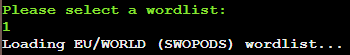
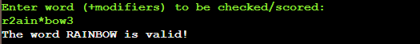
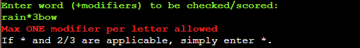
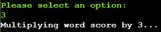
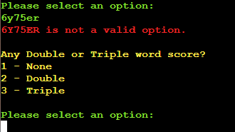
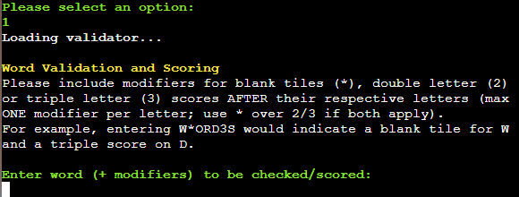
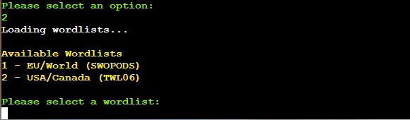
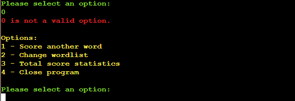
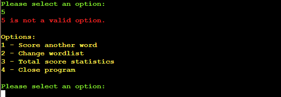
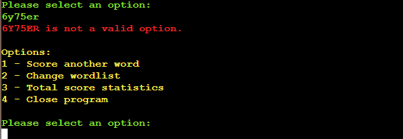

# Scrabble ScorePAD

Scrabble ScorePAD is an application designed to help validate and score words during a game of Scrabble. The following user stories were created to aid its development:

- As a casual Scrabble player, I want to check words I'm playing so I know they are valid
- As casual player, I want an easy way to calculate my word score quickly so I can get on with playing the game and avoid making mistakes when scoring
- As an average player, I want an easy way to score each word I play and keep overall track of my score
- As a more seasoned player, I want the option to score only words on Scrabble's tournament list (TWL06) so I can ready myself for official competition 

[LIVE LINK TO SITE](https://scrabble-scorepad.herokuapp.com/)

Drawing on the user stories, the main aims of the application are as follows:
- To provide a helpful and intuitive app for scoring Scrabble which runs in a basic python terminal inside a browser window
- To allow the user to choose between Scrabble's two official wordlists (SWOPODS and TWL06)
- To allow the user to ensure that a word played is valid for the particular Scrabble wordlist they are using
- To allow the user to easily indicate blank tiles, double/triple letter/word scores and 'bingo' bonuses as they score each word
- To keep track of all words played and provide a running total of their scores

## Initial Development

With these aims in mind, the following flowchart was drawn up as blueprint for writing the program, breaking down the various stages of input, decision, logic and function. The diagram was created using the chart design site [Lucid](https://lucid.app/lucidchart/db42b587-b151-4fc3-8d91-86050208ea20/edit?viewport_loc=-227%2C56%2C2938%2C1533%2C0_0&invitationId=inv_cbd12e3b-9927-4e6d-a169-3cadd1183444)

As development of the program progressed various new checks and functions were added into what is shown above, but this diagram provided a good starting point for the initial writing of the code.

## How To Use The Program

1. When presented with a list of options simply type the relevant number and hint 'Enter' on the keyboard
2. Firstly, one of two initial official Scrabble lists must be selected, then the user can enter the first word for scoring
3. The word to be checked should be entered along with any indication of blank tiles used and/or double/triple letter scores:
- Use '*' after a letter to indicate the tile is blank
- Use '2' after a letter to indicate a double letter score
- Use '3' after a letter to indicate a double letter score
- If a blank tile and double/triple letter score appear together simply use '*'
4. The input will be checked to ensure it is valid and that the word appears on the previously selected wordlist
5. The user will then be offered the opportunity to indicate a double/triple word score and 'bingo' (all tiles used) bonus, if applicable
6. Once all scoring types have been indicated, the final score and breakdown is presented to the user
7. The user is then presented with the option of scoring another word, changing the wordlist, showing a full list of words scored or closing the program
8. The program will run and continue to score words/keep score until the user chooses to close the program 

## Features 

### Page Layout & Styling

__Tab, Title & Background__

- A favicon is included as part of the tab styling, taking the form of an 'S' tile found in Scrabble.
- The title is placed at the top of the page above the terminal to clearly indicate the program in use.
- Clicking the title will not refresh/redirect the page as this would interrupt the program.
- No navigation bar is provided as this site has a one-page focus; interaction occurs through means of the terminal.
- A background image of a Scrabble board emphasises the theme of the program and helps with eye strain , preventing a dark terminal on a bright background

__Terminal Formatting__

- Text within the terminal has been coloured to help with readability and information perception:
  - Cyan is used for main headings such as the welcome/closing messages.
  - Yellow is used for menu headings and their options.
  - Green is used for those times user input is required.
  - Red is used for error messages.
  - White is used for all other pieces of informational text.

__'Run Program' Button__

- A button is placed below the terminal as a means of restarting the program after it ends or in the event of an error.
- The button is styled with hover elements to provide feedback to the user.

### Program Features

__Wordlist Selection__
- The user has the option of selecting one of two official Scrabble wordlists
- This allows casual/tournament players and those from different regions to make use of the program
- Any invalid data entry is noted by the program and notice is given to the user

__Word & Modifier Input__
- After selecting the relevant wordlist, the word to be checked/scored is entered
- At this point the user also indicates blank tiles and/or double/triple letter scores
- Asking for input of letters and modifiers together keeps data-string entry to a minimum
- Any invalid data entry is noted by the program and notice is given to the user
- Specifically, the following errors will be caught and require correction before proceeding:
  - Data entry less than two characters long (no one-letter words exist on Scrabble lists)
  - Data entry that contains invalid characters (only letters and *,2,3 permitted)
  - More than one modifier indicated beside a letter (blank takes precedence over double/triple)
  - Data entry that begins with a modifier (modifiers are to be placed after letters)
- Valid inputs have their letter values taken from an in-built dictionary and are ignored/doubled/tripled where appropriate

__Word Validation__
- Any modifiers entered in the previous step are omitted by the program so the word can be read correctly
- The program checks to see if the word entered appears on the previously selected wordlist
- If an invalid word is entered the user is notified and the end program menu is presented
- A valid word causes the program to proceed to the final checks before scoring

__Multiplier menu__
- If a valid word is entered, options for double/triple word scores are presented
- Certain options will only appear depending on word length given the layout of an official Scrabble board
  - Words < 7 letters can only have a single double/triple word score
  - Words of 7+ letters also have a double x2 option
  - Words of 8+ letters also have a triple x2 option
  - Words of 15 letters have a triple x3 option
- Any double/triple score selected is applied to the base value of the word from the previous step
- Any invalid data entry is noted by the program and notice is given to the user

__Bonus Menu__
- If a word is 7+ letters the option to include a bonus score is presented
- If this option is confirmed as 'Yes', 50 points are added to the word score
- Any invalid data entry is noted by the program and notice is given to the user

__Word Score__
- After all of these steps have been completed the final word score is displayed
- This screen gives a base score, multiplied score, bonus score and final total
- The word scored is also presented alongside the original string that was entered by the user
- This breakdown allows the user to see exactly how they have scored the total given

__End Of Program Menu__
- Immediately after the score is shown, various options appear on screen to benefit the user experience
  1. The user can immediately score a new word without the need to change wordlist
  2. The user can change wordlist before scoring again
  3. The user can view all words scored so far, including their individual scores and total
  4. The user can safely exit the program when finished
- This allows the program to be used in a continuous manner without the need to reset the terminal
- Any invalid selection is noted by the program and notice is given to the user

__Total Score Screen__
- Selecting the third option from above displays a full list of scored words
- Each entry also shows the entered string, multiplier/bonus scores and individual score for each word
- A total score for all words entered is also displayed allowing the program to be used a scoring tool in a real game of Scrabble
- Immediately following this, the previous options are displayed to the user once again
- Any invalid selection at this point is noted by the program and notice is given to the user

## Testing

The following tests have been run on each part of the program to ensure that it is operating as expected:

`Initial Startup`
| Feature | Test | Input(s) | Expected | Result | Display | Pass/Fail |
|-|-|-|-|-|-|-|
| Welcome Message | Run program | n/a | Welcome message showing program is running | Welcome message displayed as expected |  | Pass |

`Wordlist Selection`
| Feature | Test | Input(s) | Expected | Result | Display | Pass/Fail |
|-|-|-|-|-|-|-|
| Wordlist Menu | Run program | n/a | Menu showing options '1 - EU/Word (SOWPODS), 2 - US/Canada (TWL06)' awaiting input from user | Options and input request displayed as expected |  | Pass |
| Wordlist Selection | Valid input | 1 2 | Confirmation message referencing chosen wordlist |  Confirmation message displayed as expected |   | Pass |
| Wordlist Selection | Invalid input: none | [blank] | Error message requesting option selection and redisplaying of valid options | Error message and repeat of options menu displayed as expected |  | Pass |
| Wordlist Selection | Invalid inputs: <1 >2 String | 0 3 6y75er | Error message referencing input and redisplaying of valid options | Error message and repeat of options menu displayed as expected |    | Pass |

`Word & Modifier Input`
| Feature | Test | Input(s) | Expected | Result | Display | Pass/Fail |
|-|-|-|-|-|-|-|
| Word Validation Instruction | Run program | n/a | Message showing input instructions, awaiting input from user | Message and input request displayed as expected |  | Pass |
| Word Input | Letters only | rainbow | Confirmation message showing word (capitalised) as valid | Confirmation message displayed as expected |  | Pass |
| Word Input | Letters with valid modifiers | r2ain*bow3 | Confirmation message showing word without modifiers (capitalised) as valid | Confirmation message displayed as expected |  | Pass |
| Word Input | Invalid characters | rai4nbow | Error message giving detail of invalid characters and a reminder of what is allowed | Error message displayed as expected |  | Pass |
| Word Input | none | [blank] | Error message explaining words must be at least 2 letters long | Error message displayed as expected |  | Pass |
| Word Input | <2 characters | a | Error message explaining words must be at least 2 letters long | Error message displayed as expected |  | Pass |
| Word Input | Opening modifier | 2rainbow | Error message explaining input must begin with a letter | Error message displayed as expected |  | Pass |
| Word Input | >2 modifiers on one letter | rain*3bow | Error message explaining only one modifier per letter is allowed | Error message displayed as expected |  | Pass |
| Word Validator | Valid word entered | colorise [EU wordlist] | Confirmation message showing word (capitalised) as valid | Confirmation message displayed as expected |  | Pass |
| Word Validator | Invalid word entered | colorise [US wordlist] | Error message showing word (capitalised) as invalid for particular list | Error message displayed as expected |  | Pass |

`Double/Triple Score Indication`
| Feature | Test | Input(s) | Expected | Result | Display | Pass/Fail |
|-|-|-|-|-|-|-|
| Double/Triple Score Menu | Word <7 letters length | object | Menu showing options '1 - None, 2 - Double, 3 - Triple' awaiting input from user | Specified options and input request displayed as expected |  | Pass |
| Double/Triple Score Menu | Word 7 letters length | objects | Menu showing all options above plus '4 - Double x2' along with input request from user | Specified options and input request displayed as expected |  | Pass |
| Double/Triple Score Menu | Word 8-14 letters length | objectify | Menu showing all options above plus '5 - Triple x2' along with input request from user | Specified options and input request displayed as expected |  | Pass |
| Double/Triple Score Menu | Word 15 letters length | objectification | Menu showing all options above plus '6 - Triple x3' along with input request from user | Specified options and input request displayed as expected |  | Pass |
| Multiplier Selection | Valid inputs | 1 2 3 4 5 6 | Confirmation message showing multiplication factor specific to chosen option | Confirmation and correct multiplication factor displayed as expected |       | Pass |
| Multiplier Selection | Invalid input: none | [blank] | Error message requesting option selection and redisplaying of valid options | Error message and repeat of options menu displayed as expected |  | Pass |
| Multiplier Selection | Invalid inputs: <1 >max String | 0 4 6y75er | Error message referencing input and redisplaying of valid options | Error message and repeat of options menu displayed as expected |    | Pass |

`Bonus Score Indication`
| Feature | Test | Input(s) | Expected | Result | Display | Pass/Fail |
|-|-|-|-|-|-|-|
| Bonus Score Menu | Word <7 letters length | object | Menu does not display as word contains <7 letters | Menu is skipped as expected (Final word score displayed immediately) |  | Pass |
| Bonus Score Menu | Word >6 letters length | rainbow | Menu showing options '1 - Yes, 2 - No' awaiting input from user | Menu and input request displayed as expected |  | Pass |
| Bonus Selection | Valid inputs | 1 2 | Confirmation message showing bonus applied/not applied as appropriate | Confirmation displayed as expected |   | Pass |
| Bonus Selection | Invalid input: none | [blank] | Error message requesting option selection and redisplaying of valid options | Error message and repeat of options menu displayed as expected |  | Pass |
| Bonus Selection | Invalid inputs: <1 >2 String | 0 3 6y75er | Error message referencing input and redisplaying of valid options | Error message and repeat of options menu displayed as expected |    | Pass |

`Final Word Score Breakdown`
| Feature | Test | Input(s) | Expected | Result | Display | Pass/Fail |
|-|-|-|-|-|-|-|
| Final Score Message | Valid inputs: multiple mods only, one mod word x2, no mods word x3 bonus | r2ain*bow3 col3orise objects | Final word score showing breakdown of letter score (including modifiers) and any multipliers/bonuses | Final word score breakdown displayed as expected |    | Pass |

`End Menu Selection`
| Feature | Test | Input(s) | Expected | Result | Display | Pass/Fail |
|-|-|-|-|-|-|-|
| End Menu | Run program | n/a | Menu showing options '1 - Score another word, 2 - Change wordlist, 3 - Total score statistics, 4 - Close Program' awaiting input from user | Menu and input request displayed as expected |  | Pass |
| End Menu Selection | Valid input | 1 | Program returns to Word Validation message and input line | Message and input request displayed as expected |  | Pass |
| End Menu Selection | Valid input | 2 | Program returns to Wordlist menu and input line | Menu and input request displayed as expected |  | Pass |
| End Menu Selection | Valid input | 3 | Program returns a list showing all words scored and their scoring types, alongside individual scores and an overall total | Words and scores displayed as expected |  | Pass |
| End Menu Selection | Valid input | 4 | Program exits safely displaying a farewell message and no further options | Program stops and farewell message displayed as expected |  | Pass |
| End Menu Selection | Invalid input: none | [blank] | Error message requesting option selection and redisplaying of valid options | Error message and repeat of options menu displayed as expected |  | Pass |
| End Menu Selection | Invalid inputs: <1 >4 String | 0 5 6y75er | Error message referencing input and redisplaying of valid options | Error message and repeat of options menu displayed as expected |    | Pass |

### Validator Testing 

- PEP8: No errors were returned when passing the program through the [PEP8 Validator](https://pep8ci.herokuapp.com/)

### Fixed Bugs

- The `string_validator()` function was running into problems with regard to some very particular string inputs which while unlikely to be entered by the user were very much possible and could crash the program. This was resolved by ensuring that the error checking is performed in a very particular order and will not proceed to the next stage of an error is found.
- The `word_validator()` function was running into an error after running for a second time i.e. when the user tried to score a second word, specifically with the name of the particular `.txt` file not being carried over correctly from one iteration to the next. This was resolved by storing only the name of the particular file as a variable (`wordlist_file`) and not the entire filepath each time.
- The function `evaluate_letters()` was not calculating the word score correctly, choosing to leave off the final letter each time if was not followed by a modifiers. This was resolved by adding a 'dummy' character of `!` at the start of the function.

### Unfixed Bugs

- No operational/exceptional bugs are known at this time.

## Deployment

A live link to the site can be found here: https://dashboard.heroku.com/apps/scrabble-scorepad 

### Heroku App Deployment

This site was deployed to Heroku as an app. Steps for deployment are as follows (NB to do this yourself, you will first need to fork the GitHub repository as outlined below): 
  1. In Heroku, create a new app with a unique name of your choice
  2. When prompted or under settings, set the buildpacks to Python and Node JS, in that order
  3. Under the same tab, create a Config Var with Key: 'PORT' and Value: '8000'
  4. Link the Heroku app to the repository and click on Deploy

### Forking the GitHub Repository

Forking the repository allows for a copy to be made without affecting the original. Steps for forking are as follows:
  1. Log in to GitHub (requires an account) and locate the [GitHub Repository for Scrabble ScorePAD](https://github.com/ndsurgenor/scrabble-scorepad)
  2. Locate and click the 'Fork' button near the very top right of the repository page.
  3. This will create a copy of the original Scrabble ScorePAD repository in your own GitHub account.

## Credits 

- Overview image created using [Am I Responsive?](https://ui.dev/amiresponsive?url=https://scrabble-scorepad.herokuapp.com/)
- Flowchart designed using [Lucid Charts](https://lucid.app/lucidchart/db42b587-b151-4fc3-8d91-86050208ea20/edit?viewport_loc=-227%2C56%2C2938%2C1660%2C0_0&invitationId=inv_cbd12e3b-9927-4e6d-a169-3cadd1183444)
- Favicon created with [favicon.io](https://favicon.io/)
- Background image attributed to 'Barrow Boy' used under Creative Commons licence via [Wikipedia Commons](https://upload.wikimedia.org/wikipedia/commons/5/5d/Scrabble_game_in_progress.jpg)
- README.md file adapted from the [Code Institute 'ULTIMATE Battleships'](https://learn.codeinstitute.net/courses/course-v1:CodeInstitute+PE_PAGPPF+2021_Q2/courseware) example