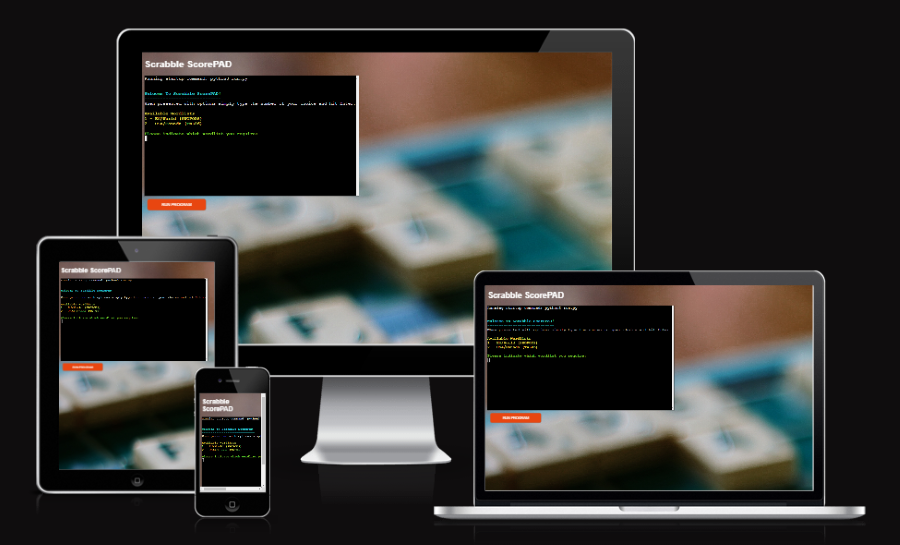

# Scrabble ScorePAD

Scrabble ScorePAD an application designed to help validate and score words during a game of Scrabble.

[LIVE LINK TO SITE](https://scrabble-scorepad.herokuapp.com/)

The main aims of the application are as follows:
- To provide a helpful and intuitive app for scoring Scrabble which runs in a basic python terminal inside a browser window
- To allow the user to ensure that a word played is valid for the particular Scrabble wordlist they are using
- To allow the user to easily indicate blank tiles, double/triple letter/word scores and 'bingo' bonuses as score each word
- To keep track of all words played and providing a running total of their scores

## Initial Development

- With these aims in mind, the following was drawn up as blueprint for writing the program, breaking down the various stages of input, decision, logic and function
- The diagram was created using the chart design site [Lucid](https://lucid.app/lucidchart/db42b587-b151-4fc3-8d91-86050208ea20/edit?viewport_loc=-227%2C56%2C2938%2C1533%2C0_0&invitationId=inv_cbd12e3b-9927-4e6d-a169-3cadd1183444)

As development of the program progressed various new checks and functions were added into what is shown above, but this diagram provided a good starting point for the initial writing of the code.

## How To Use The Program

- When presented with a list of options simply type the relevant number and hint 'Enter' on the keyboard
- Firstly, one of two initial offical Scrabble lists must be selected, then the user can enter the first word for scoring
- The word to be checked should be entered along with any indication of blank tiles used and/or double/triple letter scores
  - Use * after a letter to indicate the tile is blank
  - Use 2 after a letter to indicate a double letter score
  - Use 3 after a letter to indicate a double letter score
  - If a blank tile and double/triple letter score appear togrther simply use *
- The input will be checked to ensure it is valid and that the word appears on the previously selected wordlist
- The user will then be offered the oppurtunity to indicate a double/triple word score and 'bingo' (all tiles used) bonus, if applicable
- Once all scoring types have been indicated, the final score and breakdown is presented to the user
- The user is then presented with the option of scoring another word, changing the wordlist, showing a full list of words scored or closing the program
- The program will run and continue to score words/keep score until the user chooses to close the program 

## Features 

### Existing Features

- __Favicon & Title__

  - A favicon is included as part of the tab styling, taking the form of the stylised 'Q' found in the game's title.
  - The title is placed at the top of the page and centrally located to emphasise the name and branding of the game.
  - Clicking the logo will not refresh/redirect the page as this would interrupt the game experience.
  - No navigation bar is provided as this site has a one-page focus; interaction occurs through means of a clickable grid/buttons.
  - A text banner under the title provides useful feedback to the user as to the current state of the game.

- __Info Banner__

  - Messages displayed within the banner are restricted to 30 characters so as to avoid formatting issues and ensure the info provide is succinct.
  - At the outset of the game, the banner instructs the user saying 'Click any 1 to begin' [Fig A].
  - During normal game play, the banner will show which number must be selected next alongside the current upper limit [Fig B].
  - Clicking an unavailable block (empty or greyed-out) will display the message 'Block unavailable. Select a {required number}' [Fig C].
  - Clicking an incorrect number will display the message 'Next number must be {required number}' [Fig D].
  - When no more moves are possible i.e. the required number is not available, the text displays 'Required {required number} is unavailable' [Fig E].
  - If the user tries to select a block when the game is over, the message 'Click New Game to start over' appears as a reminder [Fig F].
  - Messages are formatted consistently with colours and styles of blocks/buttons in the game area (see following).

- __Game Area__

  - Blocks within the grid feature high contrast background colours for ease of readability.
  - Blocks are also coloured in order to convey important gameplay info to the user:
    - 1, 2, 3, and 4 are consistently styled with specific colours - crimson, darkorange, forestgreen and royalblue, respectively - as they are the main focus of gameplay.
    - 5 to 9 are consistently styled with the background colour rebeccapurple as they cannot be selected by the user.
    - Empty cells have a background colour identical to that of the grid (lightblue).
    - Unavailable cells use a background colour (gainsboro) to show they are greyed-out.
  - When using a mouse, hovering over a particular block will provide feedback to the user by highlighting its border.
  - Cursor styles are also used provide feedback: a 'pointer/hand' for available blocks and a 'not allowed' style for those which are unavailable.
  - The game is coded to setup the grid with a minimum of seven number 1s in order to prevent an immediate 'end of game' state.

- __Level & Block Counters__

  - Feedback regarding progress is given via the 'Level' and 'Blocks cleared' counters located under the grid.
  - For every 16 blocks cleared the Level counter increases by one giving the user a short term goal and keeping them engaged.
  - This level increase also corresponds to the increase of the limit displayed in the info banner (up to a maximum of 9).

- __New Game & Rules Buttons__

  - These buttons (indeed all within the game) are formatted so as to change their visual style when hovered over.
  - Icons used in conjunction with the button text provide a visual metaphor for the user as to their function.
  - The 'New Game' button allows the user to abandon their current game and start afresh.
  - When 'New Game' is selected, a confirmation dialog will appear so that the current game is not interrupted accidentally.
  - This dialog does not appear when 'New Game' is clicked alongside the 'GAME OVER' message allowing the user to start a new game immediately.
  - The 'Rules' button displays the rules text over the main game area.  

- __Rules__ 

  - Various headers and paragraphs help to organise and divide up what is a substantial amount of text for the user.
  - The main aim of the game is clearly stated at the top of the rules text so the user knows immediately what they are trying to achieve.
  - The rest of the text is split into two sections to make it more readable and easier to internalise.
  - References to blocks within the text are formatted in the same way as they appear in the game itself giving a visual consistency.
  - A button with text and accompanying icon appears at the bottom of the text as a means of closing the dialog.

- __Game Over Message__

  - When no more moves are available, the user is alerted via an animated 'GAME OVER' window.
  - The main game area utilises a fade animation (in reverse) at the same time to further highlight that the game is over.
  - The 'GAME OVER' window either informs the user of the current high score or that they have achieved a new high score.
  - A short paragraph informs the user that their high scores are only tracked while the browser remains unrefreshed.
  - A 'View Grid' button allows the user to see the final grid state before starting a new game.
  - The 'New Game' button within the dialog functions in the same manner as to that below the grid.

- __Footer__

  - The footer provides a visitor to the site with copyright info for the design and coding of the game.

- __404 Page__

  - A stylised 404 page is presented to the user if they enter an incorrect web address
  - The error page is styled to match the elements and text of the game.
  - A link allows the user to immediately navigate to the correct page and play the game.
  - If the user does not use the link, the page will automatically redirect to the main page after a short number of seconds.

### Features to Implement

The following are ideas which can be implemented into the site at a later time (when skillset allows):
- Add the ability to save high-scores and usernames to a back-end server allowing users to compare their scores with all visitors to the site.
- Add keyboard navigation for desktop users allowing them to move around the grid using WASD/arrow keys and select blocks using Spacebar.

## Testing

### General Testing

- This site has been tested for responsiveness across different screen sizes by utilizing Google Chrome's developer tools. The following link provides a [Responsive Preview](https://ui.dev/amiresponsive?url=https://ndsurgenor.github.io/quadulo/) of various screen sizes.
- This site has been tested for responsiveness in 'real-world' contexts by viewing the site on widescreen desktop and laptop setups, medium-screen tablets, and smaller-screen smartphone devices.
- This site has also been tested for responsiveness on various browsers including Chrome, Firefox, Edge and Safari.
- Text, graphics and grid/dialog boxes have been tested to ensure that they resize correctly on smaller screens.

### Gameplay & Banner Testing

- The setupGame() function has been tested by previously including a console.log() in the code which displayed the number of 1s present in the starting grid. This made it easier to see that between 7 to 14 number 1s were being created at setup, as is intended. The game was loaded in the browser multiple times to obtain multiple setup states and view this log. In each case the correct banner message of 'Click any 1 to begin' was also displayed.
- The banner messages and responses of the grid were tested by trying to play the game 'incorrectly' on multiple occasions; for example, clicking 1234 out of sequence, attempting to select greyed-out cells, attempting to click numbers higher than 4. In the early stages of the game's development these error states were feedback using alert() messages, later replaced by the info banner text which is now in game.
- The display of GAME OVER and recording of current/new high scores was tested by playing the game multiple times within one session of the browser window. Again console.log() messages were originally used, this time to record the value of the val, bloc, req and endCheck variables within the console. Originally an alert() message was invoked to indicate the end of game which then became a banner message and finally the dialog which is now in-game.
- All of these features have been tested by both loading a new game into the browser and initiating a new game using the button below the grid in order to ensure that particular variables were being reset as necessary.

### Button Testing

- The 'New Game' button has been tested during multiple game states (setup, mid-game, game over) to ensure that the confirmation dialog appears as intended and indeed that it does not appear when a game has reached its conclusion. This confirmation has also been extensively checked to ensure that it either begins a new game correctly ('Yes' selected) or returns the user to their current game ('No' selected) without any other change of variable.
- The 'Rules' button has been tested to ensure it displays correctly over the grid and other buttons, without the repositioning of other elements, and that the 'OK - Got it!' button within the rules dialog closes the window correctly so that the user can continue their game, again without changing any other variables.
- The 'View Grid' and 'New Game' buttons appearing within the GAME OVER dialog have been tested to ensure that they hide the dialog/unfade the grid and start a new game without the need for confirmation, respectively.

### Link & Redirect Testing

- The 'CLICK HERE' link within the 404.html page has been tested to ensure it directs within the same window to the index.html page.
- The meta tag within the 404.html head has also been tested to ensure that the page automatically redirects the user within the same window to index.html after 7 seconds if they decide not to use the aforementioned link.

### Validator Testing 

- HTML: No errors were returned when passing each HTML page through the official W3C HTML validator
  - [index.html](https://validator.w3.org/nu/?doc=https%3A%2F%2Fndsurgenor.github.io%2Fquadulo%2Findex.html)
  - [404.html](https://validator.w3.org/nu/?doc=https%3A%2F%2Fndsurgenor.github.io%2Fquadulo%2F404.html)
- CSS: No errors were found when passing 'style.css' through the official [W3C CSS Validator](https://jigsaw.w3.org/css-validator/validator?uri=https%3A%2F%2Fndsurgenor.github.io%2Fquadulo&profile=css3svg&usermedium=all&warning=1&vextwarning=&lang=en)
- JS: No errors were found when passing 'script.js' through the [JSHint Validator](https://jshint.com/)
- Accessibility & Performance: A perfect accessibility score was confirmed using Lighthouse in Chrome Developer Tools for both mobile and desktop sites. Performance scored 92/100 for Mobile and a perfect 100 on Desktop.

  

### Fixed Bugs

- On certain mobile devices the font-family 'Museo Moderno' was not displaying correctly. This was resolved by setting the import link in the CSS file to weight: 600 and specifying this same weight under the h1 styling header within the same CSS file.
- Certain messages displayed above the grid were causing formatting issues as they proved to contain too many characters. This has been resolved by restricting any messages in the info banner to 30 characters and making note of such in the JS file.
- Without specific code to determine how many 1s appear during game setup, unwinnable game states were appearing in a small number of situations. There was also a small chance that the grid could be almost be entirely filled at setup, presenting a less engaging challenge for the user. Both of these were resolved by placing the setup code within a 'do-while' loop ensuring that the number of 1s in any starting grid fall within the range 7-14 inclusive.
- On occasion, unavailable cells were not displaying their correct style i.e. being greyed-out. This was resolved by altering the code within the cellStyle function from that of an 'if-else' loop to instead placing the relevant code at the end of the function so that it would overwrite any previous styling.

### Unfixed Bugs

- No bugs regarding graphic display and/or gameplay are known at this time.

## Deployment

A live link to the site can be found here: https://dashboard.heroku.com/apps/scrabble-scorepad 

### GitHub Pages

- This site was deployed to GitHub pages. Steps for deployment are as follows: 
  - In the GitHub repository, navigate to the Settings tab (top right)
  - From the options in the lefthand side menu, select Pages
  - From the Branch section drop-down menus, select 'main' and '/root' then click 'Save'
  - The page will be automatically refreshed (after a short period) to indicate the successful deployment.

### Forking the GitHub Repository

- Forking the repository allows for a copy to be made without affecting the original. Steps for forking are as follows:
  - Log in to GitHub (requires an account) and locate the [GitHub Repository for Scrabble ScorePAD](https://github.com/ndsurgenor/scrabble-scorepad)
  - Locate and click the 'Fork' button near the very top right of the repository page.
  - This will create a copy of the original Quadulo repository in your own GitHub account.

## Credits 

- Overview image created using [Am I Responsive?](https://ui.dev/amiresponsive?url=https://scrabble-scorepad.herokuapp.com/)
- Flowchart designed using [Lucid Charts](https://lucid.app/lucidchart/db42b587-b151-4fc3-8d91-86050208ea20/edit?viewport_loc=-227%2C56%2C2938%2C1660%2C0_0&invitationId=inv_cbd12e3b-9927-4e6d-a169-3cadd1183444)
- Favicon created with [favicon.io](https://favicon.io/)
- README.md file adapted from the [Code Institute 'ULTIMATE Battleships'](https://learn.codeinstitute.net/courses/course-v1:CodeInstitute+PE_PAGPPF+2021_Q2/courseware) example