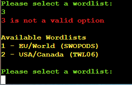
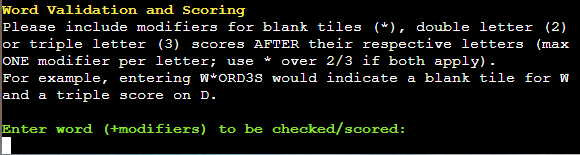
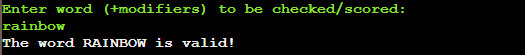
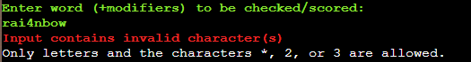
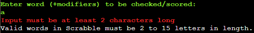
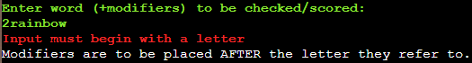

# Scrabble ScorePAD

Scrabble ScorePAD an application designed to help validate and score words during a game of Scrabble.

[LIVE LINK TO SITE](https://scrabble-scorepad.herokuapp.com/)

The main aims of the application are as follows:
- To provide a helpful and intuitive app for scoring Scrabble which runs in a basic python terminal inside a browser window
- To allow the user to ensure that a word played is valid for the particular Scrabble wordlist they are using
- To allow the user to easily indicate blank tiles, double/triple letter/word scores and 'bingo' bonuses as score each word
- To keep track of all words played and providing a running total of their scores

## Initial Development

- With these aims in mind, the following was drawn up as blueprint for writing the program, breaking down the various stages of input, decision, logic and function
- The diagram was created using the chart design site [Lucid](https://lucid.app/lucidchart/db42b587-b151-4fc3-8d91-86050208ea20/edit?viewport_loc=-227%2C56%2C2938%2C1533%2C0_0&invitationId=inv_cbd12e3b-9927-4e6d-a169-3cadd1183444)

As development of the program progressed various new checks and functions were added into what is shown above, but this diagram provided a good starting point for the initial writing of the code.

## How To Use The Program

- When presented with a list of options simply type the relevant number and hint 'Enter' on the keyboard
- Firstly, one of two initial offical Scrabble lists must be selected, then the user can enter the first word for scoring
- The word to be checked should be entered along with any indication of blank tiles used and/or double/triple letter scores
  - Use '*' after a letter to indicate the tile is blank
  - Use '2' after a letter to indicate a double letter score
  - Use '3' after a letter to indicate a double letter score
  - If a blank tile and double/triple letter score appear togrther simply use '*'
- The input will be checked to ensure it is valid and that the word appears on the previously selected wordlist
- The user will then be offered the oppurtunity to indicate a double/triple word score and 'bingo' (all tiles used) bonus, if applicable
- Once all scoring types have been indicated, the final score and breakdown is presented to the user
- The user is then presented with the option of scoring another word, changing the wordlist, showing a full list of words scored or closing the program
- The program will run and continue to score words/keep score until the user chooses to close the program 

## Features 

### Existing Features

- __Favicon & Title__

  - A favicon is included as part of the tab styling, taking the form of an 'S' tile found in Scrabble.
  - The title is placed at the top of the page above the terminal to clearly indicate the program in use.
  - Clicking the title will not refresh/redirect the page as this would interrupt the program.
  - No navigation bar is provided as this site has a one-page focus; interaction occurs through means of the terminal.

<!-- - __Info Banner__

  - Messages displayed within the banner are restricted to 30 characters so as to avoid formatting issues and ensure the info provide is succinct.
  - At the outset of the game, the banner instructs the user saying 'Click any 1 to begin' [Fig A].
  - During normal game play, the banner will show which number must be selected next alongside the current upper limit [Fig B].
  - Clicking an unavailable block (empty or greyed-out) will display the message 'Block unavailable. Select a {required number}' [Fig C].
  - Clicking an incorrect number will display the message 'Next number must be {required number}' [Fig D].
  - When no more moves are possible i.e. the required number is not available, the text displays 'Required {required number} is unavailable' [Fig E].
  - If the user tries to select a block when the game is over, the message 'Click New Game to start over' appears as a reminder [Fig F].
  - Messages are formatted consistently with colours and styles of blocks/buttons in the game area (see following).

 -->

- __404 Page__

  - A stylised 404 page is presented to the user if they enter an incorrect web address
  - A link allows the user to immediately navigate to the correct page and play the game.
  - If the user does not use the link, the page will automatically redirect to the main page after a short number of seconds.

<!-- ### Features to Implement

The following are ideas which can be implemented into the site at a later time (when skillset allows):
- Add the ability to save high-scores and usernames to a back-end server allowing users to compare their scores with all visitors to the site.
- Add keyboard navigation for desktop users allowing them to move around the grid using WASD/arrow keys and select blocks using Spacebar. -->

## Testing

The following tests have been run on each part of the program to ensure that it is operating as expected:

`Initial Startup`
| Feature | Test | Input(s) | Expected | Result | Display | Pass/Fail |
|-|-|-|-|-|-|-|
| Welcome Message | Run program | n/a | Displays at start to show program is running | Welcome message displayed as expected |  | Pass |

`Wordlist Selection`
| Feature | Test | Input(s) | Expected | Result | Display | Pass/Fail |
|-|-|-|-|-|-|-|
| Wordlist Menu | Run program | n/a | Menu shows wordlist options and numbers alongside input request from user | Options and input request displayed as expected |  | Pass |
| Wordlist Selection | Valid input | 1, 2 | Selecting a valid option displays a specific confirmation message and moves to next section |  Program continues to next section with correct display message |   | Pass |
| Wordlist Selection | Invalid input [<1, >2, String] | 0, 3, 6y75er | Selecting an invalid option displays an error message and repeats the valid options | Error message displays followed by valid wordlist options |    | Pass |

`Word & Modifier Input`
| Feature | Test | Input(s) | Expected | Result | Display | Pass/Fail |
|-|-|-|-|-|-|-|
| Word Input | Letters only | rainbow | Confirmation message showing word (capitilised) as valid | Confirmation message displayed as expected |  | Pass |
| Word Input | Letters with valid modifiers | r2ain*bow3 | Confirmation message showing word without modifiers (capitilised) as valid | Confirmation message displayed as expected |  | Pass |
| Word Input | Invalid characters | rai4nbow | Error message showing string (capitilised) as invalid | Error message displyed as expected |  | Pass |
| Word Input | <2 characters | a | Error message explaining words must be at least 2 letters long | Error message displyed as expected |  | Pass |
| Word Input | Opening modifier | 2rainbow | Error message explaining input must begin with a letter | Error message displyed as expected |  | Pass |
| Word Input | >2 modifiers on one letter | rain*3bow | Error message explaining only one modifier per letter is allowed | Error message displyed as expected |  | Pass |
| Word Validator | Valid word entered | colorise [EU wordlist], colorize [US wordlist] | Confirmation message showing word (capitilised) as valid | Confirmation message displayed as expected |  | Pass |
| Word Validator | Invalid word entered | colorize [EU wordlist], colorise [US wordlist] | Error message showing word (capitilised) as invalid for particular list | Error message displyed as expected |  | Pass |

`Double/Triple Score Indication`
| Feature | Test | Input(s) | Expected | Result | Display | Pass/Fail |
|-|-|-|-|-|-|-|

`Bonus Score Indication`
| Feature | Test | Input(s) | Expected | Result | Display | Pass/Fail |
|-|-|-|-|-|-|-|

`Final Word Score Breakdown`
| Feature | Test | Input(s) | Expected | Result | Display | Pass/Fail |
|-|-|-|-|-|-|-|

`Next Stage Selection`
| Feature | Test | Input(s) | Expected | Result | Display | Pass/Fail |
|-|-|-|-|-|-|-|

### Validator Testing 

- HTML: No errors were returned when passing each HTML page through the official W3C HTML validator
  - [index.html](https://validator.w3.org/nu/?doc=https%3A%2F%2Fndsurgenor.github.io%2Fquadulo%2Findex.html)
  - [404.html](https://validator.w3.org/nu/?doc=https%3A%2F%2Fndsurgenor.github.io%2Fquadulo%2F404.html)
- Accessibility & Performance: A perfect accessibility score was confirmed using Lighthouse in Chrome Developer Tools for both mobile and desktop sites. Performance scored 92/100 for Mobile and a perfect 100 on Desktop.

  

### Fixed Bugs

<!-- - On certain mobile devices the font-family 'Museo Moderno' was not displaying correctly. This was resolved by setting the import link in the CSS file to weight: 600 and specifying this same weight under the h1 styling header within the same CSS file.
- Certain messages displayed above the grid were causing formatting issues as they proved to contain too many characters. This has been resolved by restricting any messages in the info banner to 30 characters and making note of such in the JS file.
- Without specific code to determine how many 1s appear during game setup, unwinnable game states were appearing in a small number of situations. There was also a small chance that the grid could be almost be entirely filled at setup, presenting a less engaging challenge for the user. Both of these were resolved by placing the setup code within a 'do-while' loop ensuring that the number of 1s in any starting grid fall within the range 7-14 inclusive.
- On occasion, unavailable cells were not displaying their correct style i.e. being greyed-out. This was resolved by altering the code within the cellStyle function from that of an 'if-else' loop to instead placing the relevant code at the end of the function so that it would overwrite any previous styling. -->

### Unfixed Bugs

- No operational/exceptional bugs are known at this time.

## Deployment

A live link to the site can be found here: https://dashboard.heroku.com/apps/scrabble-scorepad 

### Heroku App Deployment

- This site was deployed to Heroku as an app. Steps for deployment are as follows: 
  - In the GitHub repository, navigate to the Settings tab (top right)
  - From the options in the lefthand side menu, select Pages
  - From the Branch section drop-down menus, select 'main' and '/root' then click 'Save'
  - The page will be automatically refreshed (after a short period) to indicate the successful deployment.

### Forking the GitHub Repository

- Forking the repository allows for a copy to be made without affecting the original. Steps for forking are as follows:
  - Log in to GitHub (requires an account) and locate the [GitHub Repository for Scrabble ScorePAD](https://github.com/ndsurgenor/scrabble-scorepad)
  - Locate and click the 'Fork' button near the very top right of the repository page.
  - This will create a copy of the original Scrabble ScorePAD repository in your own GitHub account.

## Credits 

- Overview image created using [Am I Responsive?](https://ui.dev/amiresponsive?url=https://scrabble-scorepad.herokuapp.com/)
- Flowchart designed using [Lucid Charts](https://lucid.app/lucidchart/db42b587-b151-4fc3-8d91-86050208ea20/edit?viewport_loc=-227%2C56%2C2938%2C1660%2C0_0&invitationId=inv_cbd12e3b-9927-4e6d-a169-3cadd1183444)
- Favicon created with [favicon.io](https://favicon.io/)
- Background image attributed to 'Barrow Boy' used under Creative Commons licence via [Wikipedia Commons](https://upload.wikimedia.org/wikipedia/commons/5/5d/Scrabble_game_in_progress.jpg)
- README.md file adapted from the [Code Institute 'ULTIMATE Battleships'](https://learn.codeinstitute.net/courses/course-v1:CodeInstitute+PE_PAGPPF+2021_Q2/courseware) example